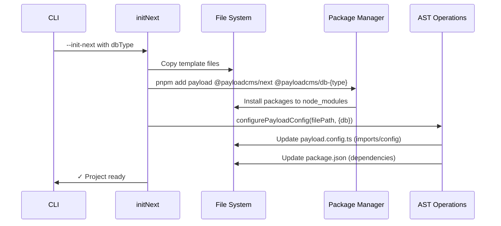
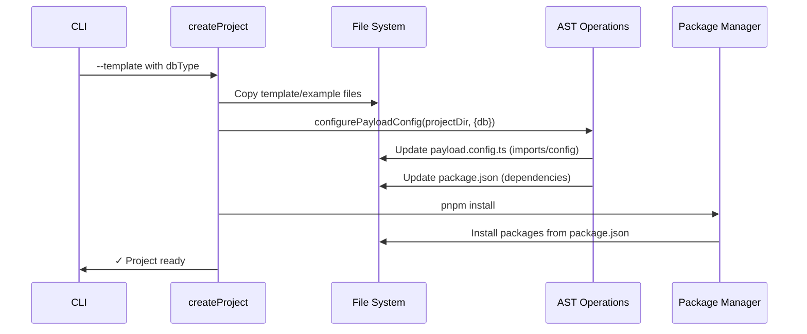

# FULLSTACK CODE DATABASE SAMPLES payload-main

## Verbatim Content (Part 117 of 695)

````text
================================================================================
FULLSTACK SAMPLES CODE DATABASE (VERBATIM) - payload-main
================================================================================
Generated: December 18, 2025
Source: fullstack_samples/payload-main
================================================================================

NOTES:
- This output is verbatim because the source is user-owned.
- Large/binary files may be skipped by size/binary detection limits.

================================================================================

---[FILE: AdminBar.tsx]---
Location: payload-main/packages/admin-bar/src/AdminBar.tsx
Signals: React

```typescript
'use client'
import React, { useEffect, useState } from 'react'

const dummyUser = {
  id: '12345',
  email: 'dev@email.com',
}

import type { PayloadAdminBarProps, PayloadMeUser } from './types.js'

export const PayloadAdminBar: React.FC<PayloadAdminBarProps> = (props) => {
  const {
    id: docID,
    adminPath = '/admin',
    apiPath = '/api',
    authCollectionSlug = 'users',
    className,
    classNames,
    cmsURL = 'http://localhost:8000',
    collectionLabels,
    collectionSlug,
    createProps,
    devMode,
    divProps,
    editProps,
    logo,
    logoProps,
    logoutProps,
    onAuthChange,
    onPreviewExit,
    preview,
    previewProps,
    style,
    unstyled,
    userProps,
  } = props

  const [user, setUser] = useState<PayloadMeUser>()

  useEffect(() => {
    const fetchMe = async () => {
      try {
        const meRequest = await fetch(`${cmsURL}${apiPath}/${authCollectionSlug}/me`, {
          credentials: 'include',
          method: 'get',
        })
        const meResponse = await meRequest.json()
        const { user } = meResponse

        if (user) {
          setUser(user)
        } else {
          if (devMode !== true) {
            setUser(null)
          } else {
            setUser(dummyUser)
          }
        }
      } catch (err) {
        console.warn(err)
        if (devMode === true) {
          setUser(dummyUser)
        }
      }
    }

    void fetchMe()
  }, [cmsURL, adminPath, apiPath, devMode])

  useEffect(() => {
    if (typeof onAuthChange === 'function') {
      onAuthChange(user)
    }
  }, [user, onAuthChange])

  if (user) {
    const { id: userID, email } = user

    return (
      <div
        className={className}
        id="payload-admin-bar"
        style={{
          ...(unstyled !== true
            ? {
                alignItems: 'center',
                backgroundColor: '#222',
                boxSizing: 'border-box',
                color: '#fff',
                display: 'flex',
                fontFamily:
                  '-apple-system, BlinkMacSystemFont, Segoe UI, Roboto, Helvetica Neue, Arial, sans-serif',
                fontSize: 'small',
                left: 0,
                minWidth: '0',
                padding: '0.5rem',
                position: 'fixed',
                top: 0,
                width: '100%',
                zIndex: 99999,
              }
            : {}),
          ...style,
        }}
      >
        <a
          className={classNames?.logo}
          href={`${cmsURL}${adminPath}`}
          {...logoProps}
          style={{
            ...(unstyled !== true
              ? {
                  alignItems: 'center',
                  color: 'inherit',
                  display: 'flex',
                  flexShrink: 0,
                  height: '20px',
                  marginRight: '10px',
                  textDecoration: 'none',
                  ...(logoProps?.style
                    ? {
                        ...logoProps.style,
                      }
                    : {}),
                }
              : {}),
          }}
        >
          {logo || 'Payload CMS'}
        </a>
        <a
          className={classNames?.user}
          href={`${cmsURL}${adminPath}/collections/${authCollectionSlug}/${userID}`}
          rel="noopener noreferrer"
          target="_blank"
          {...userProps}
          style={{
            ...(unstyled !== true
              ? {
                  color: 'inherit',
                  display: 'block',
                  marginRight: '10px',
                  minWidth: '50px',
                  overflow: 'hidden',
                  textDecoration: 'none',
                  textOverflow: 'ellipsis',
                  whiteSpace: 'nowrap',
                  ...(userProps?.style
                    ? {
                        ...userProps.style,
                      }
                    : {}),
                }
              : {}),
          }}
        >
          <span
            style={{
              ...(unstyled !== true
                ? {
                    overflow: 'hidden',
                    textOverflow: 'ellipsis',
                    whiteSpace: 'nowrap',
                  }
                : {}),
            }}
          >
            {email || 'Profile'}
          </span>
        </a>
        <div
          className={classNames?.controls}
          {...divProps}
          style={{
            ...(unstyled !== true
              ? {
                  alignItems: 'center',
                  display: 'flex',
                  flexGrow: 1,
                  flexShrink: 1,
                  justifyContent: 'flex-end',
                  marginRight: '10px',
                  ...(divProps?.style
                    ? {
                        ...divProps.style,
                      }
                    : {}),
                }
              : {}),
          }}
        >
          {collectionSlug && docID && (
            <a
              className={classNames?.edit}
              href={`${cmsURL}${adminPath}/collections/${collectionSlug}/${docID}`}
              rel="noopener noreferrer"
              target="_blank"
              {...editProps}
              style={{
                display: 'block',
                ...(unstyled !== true
                  ? {
                      color: 'inherit',
                      flexShrink: 1,
                      marginRight: '10px',
                      overflow: 'hidden',
                      textDecoration: 'none',
                      textOverflow: 'ellipsis',
                      whiteSpace: 'nowrap',
                      ...(editProps?.style
                        ? {
                            ...editProps.style,
                          }
                        : {}),
                    }
                  : {}),
              }}
            >
              <span
                style={{
                  ...(unstyled !== true
                    ? {
                        overflow: 'hidden',
                        textOverflow: 'ellipsis',
                        whiteSpace: 'nowrap',
                      }
                    : {}),
                }}
              >
                {`Edit ${collectionLabels?.singular || 'page'}`}
              </span>
            </a>
          )}
          {collectionSlug && (
            <a
              className={classNames?.create}
              href={`${cmsURL}${adminPath}/collections/${collectionSlug}/create`}
              rel="noopener noreferrer"
              target="_blank"
              {...createProps}
              style={{
                ...(unstyled !== true
                  ? {
                      color: 'inherit',
                      display: 'block',
                      flexShrink: 1,
                      overflow: 'hidden',
                      textDecoration: 'none',
                      textOverflow: 'ellipsis',
                      whiteSpace: 'nowrap',
                      ...(createProps?.style
                        ? {
                            ...createProps.style,
                          }
                        : {}),
                    }
                  : {}),
              }}
            >
              <span
                style={{
                  ...(unstyled !== true
                    ? {
                        overflow: 'hidden',
                        textOverflow: 'ellipsis',
                        whiteSpace: 'nowrap',
                      }
                    : {}),
                }}
              >
                {`New ${collectionLabels?.singular || 'page'}`}
              </span>
            </a>
          )}
          {preview && (
            <button
              className={classNames?.preview}
              onClick={onPreviewExit}
              {...previewProps}
              style={{
                ...(unstyled !== true
                  ? {
                      background: 'none',
                      border: 'none',
                      color: 'inherit',
                      cursor: 'pointer',
                      fontFamily: 'inherit',
                      fontSize: 'inherit',
                      marginLeft: '10px',
                      padding: 0,
                      ...(previewProps?.style
                        ? {
                            ...previewProps.style,
                          }
                        : {}),
                    }
                  : {}),
              }}
              type="button"
            >
              Exit preview mode
            </button>
          )}
        </div>
        <a
          className={classNames?.logout}
          href={`${cmsURL}${adminPath}/logout`}
          rel="noopener noreferrer"
          target="_blank"
          {...logoutProps}
          style={{
            ...(unstyled !== true
              ? {
                  color: 'inherit',
                  display: 'block',
                  flexShrink: 1,
                  overflow: 'hidden',
                  textDecoration: 'none',
                  textOverflow: 'ellipsis',
                  whiteSpace: 'nowrap',
                  ...(logoutProps?.style
                    ? {
                        ...logoutProps.style,
                      }
                    : {}),
                }
              : {}),
          }}
        >
          <span
            style={{
              ...(unstyled !== true
                ? {
                    overflow: 'hidden',
                    textOverflow: 'ellipsis',
                    whiteSpace: 'nowrap',
                  }
                : {}),
            }}
          >
            Logout
          </span>
        </a>
      </div>
    )
  }

  return null
}
```

--------------------------------------------------------------------------------

---[FILE: index.ts]---
Location: payload-main/packages/admin-bar/src/index.ts

```typescript
export { PayloadAdminBar } from './AdminBar.js'
export type { PayloadAdminBarProps, PayloadMeUser } from './types.js'
```

--------------------------------------------------------------------------------

---[FILE: types.ts]---
Location: payload-main/packages/admin-bar/src/types.ts
Signals: React

```typescript
import type { CSSProperties, ReactElement } from 'react'

export type PayloadMeUser =
  | {
      email: string
      id: string
    }
  | null
  | undefined

export type PayloadAdminBarProps = {
  adminPath?: string
  apiPath?: string
  authCollectionSlug?: string
  className?: string
  classNames?: {
    controls?: string
    create?: string
    edit?: string
    logo?: string
    logout?: string
    preview?: string
    user?: string
  }
  cmsURL?: string
  collectionLabels?: {
    plural?: string
    singular?: string
  }
  collectionSlug?: string
  createProps?: {
    [key: string]: unknown
    style?: CSSProperties
  }
  devMode?: boolean
  divProps?: {
    [key: string]: unknown
    style?: CSSProperties
  }
  editProps?: {
    [key: string]: unknown
    style?: CSSProperties
  }
  id?: string
  logo?: ReactElement
  logoProps?: {
    [key: string]: unknown
    style?: CSSProperties
  }
  logoutProps?: {
    [key: string]: unknown
    style?: CSSProperties
  }
  onAuthChange?: (user: PayloadMeUser) => void
  onPreviewExit?: () => void
  preview?: boolean
  previewProps?: {
    [key: string]: unknown
    style?: CSSProperties
  }
  style?: CSSProperties
  unstyled?: boolean
  userProps?: {
    [key: string]: unknown
    style?: CSSProperties
  }
}
```

--------------------------------------------------------------------------------

---[FILE: .prettierignore]---
Location: payload-main/packages/create-payload-app/.prettierignore

```text
.tmp
**/.git
**/.hg
**/.pnp.*
**/.svn
**/.yarn/**
**/build
**/dist/**
**/node_modules
**/temp
**/docs/**
tsconfig.json
```

--------------------------------------------------------------------------------

---[FILE: .swcrc]---
Location: payload-main/packages/create-payload-app/.swcrc

```text
{
  "$schema": "https://json.schemastore.org/swcrc",
  "sourceMaps": true,
  "jsc": {
    "target": "esnext",
    "parser": {
      "syntax": "typescript",
      "tsx": true,
      "dts": true
    },
    "transform": {
      "react": {
        "runtime": "automatic",
        "pragmaFrag": "React.Fragment",
        "throwIfNamespace": true,
        "development": false,
        "useBuiltins": true
      }
    }
  },
  "module": {
    "type": "es6"
  }
}
```

--------------------------------------------------------------------------------

---[FILE: CLAUDE.md]---
Location: payload-main/packages/create-payload-app/CLAUDE.md

```text
# create-payload-app

Package for creating new Payload projects with custom configurations.

## Architecture

### AST-Based File Modification

create-payload-app uses AST (Abstract Syntax Tree) parsing with ts-morph to modify template files during project creation.

**3-Phase Pipeline:**

1. **Detection** - Parse files and locate expected structures
2. **Transformation** - Pure functions modify AST
3. **Modification** - Validate, write, format with prettier

### File Structure

```txt
src/lib/ast/
├── types.ts                    # Shared types for AST operations
├── utils.ts                    # Low-level AST helpers
├── utils.spec.ts              # Unit tests for utils
├── payload-config.ts          # Payload config transformations
├── payload-config.spec.ts    # Unit tests for payload-config
├── package-json.ts            # package.json modifications
└── package-json.spec.ts      # Unit tests for package-json
```

### Key Functions

**High-level API:**

- `configurePayloadConfig(filePath, options)` - Main entry point for payload config
- `updatePackageJson(filePath, options)` - Update package.json

**Transformations:**

- `addDatabaseAdapter(sourceFile, adapter, envVar)` - Add/replace db adapter
- `addStorageAdapter(sourceFile, adapter)` - Add storage plugin
- `removeSharp(sourceFile)` - Remove sharp dependency

### Templates

All templates follow standard structure:

- `buildConfig()` call with object literal argument
- `db` property for database adapter
- `plugins` array (can be empty)

No comment markers needed - AST finds structure by code patterns.

### Package Management Flows

create-payload-app has two distinct flows for handling package installation:

#### Flow 1: `--init-next` (Next.js Integration)



**Key points:**

- Uses `pnpm add` to install specific packages
- Packages installed before AST modifications
- No final `pnpm install` step

#### Flow 2: Template/Example Creation



**Key points:**

- Updates package.json first
- Single `pnpm install` at end installs all dependencies
- Package manager resolves dependencies from package.json

**Package Operations:**

- **Install**: Runs actual `pnpm add` or `pnpm install` command (Flow 1 or Flow 2 respectively)
- **Package removal**: AST removes imports and updates package.json (orphaned packages cleaned up on next install)
- No explicit `pnpm remove` - package.json modifications only

### Testing

**Unit tests:** Test individual transformation functions
**Integration tests:** Test full create-payload-app flows

Run tests: `pnpm --filter create-payload-app test`
```

--------------------------------------------------------------------------------

---[FILE: jest.config.js]---
Location: payload-main/packages/create-payload-app/jest.config.js

```javascript
// import baseConfig from '../../jest.config.js'

// /** @type {import('@jest/types').Config} */
// const customJestConfig = {
//   ...baseConfig,
//   setupFilesAfterEnv: null,
//   testMatch: ['**/src/**/?(*.)+(spec|test|it-test).[tj]s?(x)'],
//   testTimeout: 20000,
// }

// export default customJestConfig

/** @type {import('jest').Config} */
const customJestConfig = {
  extensionsToTreatAsEsm: ['.ts', '.tsx'],
  // setupFilesAfterEnv: ['<rootDir>/jest.setup.js'],
  moduleNameMapper: {
    '\\.(css|scss)$': '<rootDir>/helpers/mocks/emptyModule.js',
    '\\.(jpg|jpeg|png|gif|eot|otf|webp|svg|ttf|woff|woff2|mp4|webm|wav|mp3|m4a|aac|oga)$':
      '<rootDir>/test/helpers/mocks/fileMock.js',
    '^(\\.{1,2}/.*)\\.js$': '$1',
  },
  testEnvironment: 'node',
  testMatch: ['<rootDir>/**/*spec.ts'],
  testTimeout: 160000,
  transform: {
    '^.+\\.(t|j)sx?$': ['@swc/jest'],
  },
  verbose: true,
}

export default customJestConfig
```

--------------------------------------------------------------------------------

---[FILE: LICENSE.md]---
Location: payload-main/packages/create-payload-app/LICENSE.md

```text
MIT License

Copyright (c) 2018-2025 Payload CMS, Inc. <info@payloadcms.com>

Permission is hereby granted, free of charge, to any person obtaining
a copy of this software and associated documentation files (the
'Software'), to deal in the Software without restriction, including
without limitation the rights to use, copy, modify, merge, publish,
distribute, sublicense, and/or sell copies of the Software, and to
permit persons to whom the Software is furnished to do so, subject to
the following conditions:

The above copyright notice and this permission notice shall be
included in all copies or substantial portions of the Software.

THE SOFTWARE IS PROVIDED 'AS IS', WITHOUT WARRANTY OF ANY KIND,
EXPRESS OR IMPLIED, INCLUDING BUT NOT LIMITED TO THE WARRANTIES OF
MERCHANTABILITY, FITNESS FOR A PARTICULAR PURPOSE AND NONINFRINGEMENT.
IN NO EVENT SHALL THE AUTHORS OR COPYRIGHT HOLDERS BE LIABLE FOR ANY
CLAIM, DAMAGES OR OTHER LIABILITY, WHETHER IN AN ACTION OF CONTRACT,
TORT OR OTHERWISE, ARISING FROM, OUT OF OR IN CONNECTION WITH THE
SOFTWARE OR THE USE OR OTHER DEALINGS IN THE SOFTWARE.
```

--------------------------------------------------------------------------------

---[FILE: package.json]---
Location: payload-main/packages/create-payload-app/package.json
Signals: Next.js

```json
{
  "name": "create-payload-app",
  "version": "3.68.5",
  "homepage": "https://payloadcms.com",
  "repository": {
    "type": "git",
    "url": "https://github.com/payloadcms/payload.git",
    "directory": "packages/create-payload-app"
  },
  "license": "MIT",
  "author": "Payload <dev@payloadcms.com> (https://payloadcms.com)",
  "maintainers": [
    {
      "name": "Payload",
      "email": "info@payloadcms.com",
      "url": "https://payloadcms.com"
    }
  ],
  "sideEffects": false,
  "type": "module",
  "exports": {
    "./types": {
      "import": "./src/types.ts",
      "require": "./src/types.ts"
    },
    "./commands": {
      "import": "./src/lib/init-next.ts",
      "require": "./src/lib/init-next.ts",
      "types": "./src/lib/init-next.ts"
    },
    "./lib/*": {
      "import": "./src/lib/*",
      "require": "./src/lib/*",
      "types": "./src/lib/*"
    },
    "./utils/*": {
      "import": "./src/utils/*",
      "require": "./src/utils/*",
      "types": "./src/utils/*"
    }
  },
  "bin": {
    "create-payload-app": "bin/cli.js"
  },
  "files": [
    "package.json",
    "dist",
    "bin"
  ],
  "scripts": {
    "build": "pnpm pack-template-files && pnpm typecheck && pnpm build:swc",
    "build:debug": "pnpm build",
    "build:swc": "swc ./src -d ./dist --config-file .swcrc --strip-leading-paths",
    "clean": "rimraf -g {dist,*.tsbuildinfo}",
    "lint": "eslint .",
    "lint:fix": "eslint . --fix",
    "pack-template-files": "node --no-deprecation --import @swc-node/register/esm-register src/scripts/pack-template-files.ts",
    "test": "jest",
    "typecheck": "tsc"
  },
  "dependencies": {
    "@clack/prompts": "^0.7.0",
    "@sindresorhus/slugify": "^1.1.0",
    "@swc/core": "1.15.3",
    "arg": "^5.0.0",
    "chalk": "^4.1.0",
    "comment-json": "^4.2.3",
    "esprima-next": "^6.0.3",
    "execa": "^5.0.0",
    "figures": "^6.1.0",
    "fs-extra": "^9.0.1",
    "globby": "11.1.0",
    "prettier": "^3.5.0",
    "tar": "^7.4.3",
    "terminal-link": "^2.1.1",
    "ts-morph": "^21.0.1"
  },
  "devDependencies": {
    "@types/esprima": "^4.0.6",
    "@types/fs-extra": "^9.0.12",
    "@types/jest": "29.5.12",
    "@types/node": "22.15.30"
  },
  "engines": {
    "node": "^18.20.2 || >=20.9.0"
  }
}
```

--------------------------------------------------------------------------------

---[FILE: README.md]---
Location: payload-main/packages/create-payload-app/README.md

```text
# Create Payload App

CLI for easily starting new Payload project

## Usage

```text

  USAGE

      $ npx create-payload-app
      $ npx create-payload-app my-project
      $ npx create-payload-app -n my-project -t website

  OPTIONS

      -n     my-payload-app         Set project name
      -t     template_name          Choose specific template

        Available templates:

        blank                       Blank Template
        website                     Website Template
        ecommerce                   E-commerce Template
        plugin                      Template for creating a Payload plugin
        payload-demo                Payload demo site at https://demo.payloadcms.com
        payload-website             Payload website CMS at https://payloadcms.com

      --use-npm                     Use npm to install dependencies
      --use-yarn                    Use yarn to install dependencies
      --use-pnpm                    Use pnpm to install dependencies
      --no-deps                     Do not install any dependencies
      -h                            Show help
```
```

--------------------------------------------------------------------------------

---[FILE: tsconfig.json]---
Location: payload-main/packages/create-payload-app/tsconfig.json

```json
{
  "extends": "../../tsconfig.base.json",
  "compilerOptions": {
    // Do not include DOM and DOM.Iterable as this is a server-only package.
    "lib": ["ES2022"],
  }
}
```

--------------------------------------------------------------------------------

---[FILE: cli.js]---
Location: payload-main/packages/create-payload-app/bin/cli.js

```javascript
#!/usr/bin/env node

import { main } from '../dist/index.js'
main()
```

--------------------------------------------------------------------------------

---[FILE: ast-integration.spec.ts]---
Location: payload-main/packages/create-payload-app/src/ast-integration.spec.ts

```typescript
import * as fs from 'fs'
import * as fse from 'fs-extra'
import * as path from 'path'
import * as os from 'os'
import { configurePayloadConfig } from './lib/configure-payload-config'
import type { DbType, StorageAdapterType } from './types'
import { DB_ADAPTER_CONFIG, STORAGE_ADAPTER_CONFIG } from './lib/ast/adapter-config'

interface TestCase {
  name: string
  template: string
  dbType: DbType
  storageAdapter: StorageAdapterType
}

const TEST_CASES: TestCase[] = [
  {
    name: 'blank + mongodb + localDisk',
    template: 'blank',
    dbType: 'mongodb',
    storageAdapter: 'localDisk',
  },
  {
    name: 'blank + postgres + vercelBlobStorage',
    template: 'blank',
    dbType: 'postgres',
    storageAdapter: 'vercelBlobStorage',
  },
  {
    name: 'website + mongodb + s3Storage',
    template: 'website',
    dbType: 'mongodb',
    storageAdapter: 's3Storage',
  },
  {
    name: 'website + postgres + localDisk',
    template: 'website',
    dbType: 'postgres',
    storageAdapter: 'localDisk',
  },
  {
    name: 'ecommerce + mongodb + localDisk',
    template: 'ecommerce',
    dbType: 'mongodb',
    storageAdapter: 'localDisk',
  },
  {
    name: 'ecommerce + postgres + r2Storage',
    template: 'ecommerce',
    dbType: 'postgres',
    storageAdapter: 'r2Storage',
  },
]

describe('AST Integration Tests', () => {
  let tempDir: string
  const templatesRoot = path.resolve(__dirname, '../../..', 'templates')

  beforeEach(() => {
    tempDir = fs.mkdtempSync(path.join(os.tmpdir(), 'payload-ast-integration-'))
  })

  afterEach(() => {
    if (tempDir && fs.existsSync(tempDir)) {
      fs.rmSync(tempDir, { recursive: true, force: true })
    }
  })

  describe.each(TEST_CASES)('$name', ({ template, dbType, storageAdapter }) => {
    it('successfully applies AST transformations', async () => {
      // Setup: Copy template to temp directory
      const templateDir = path.join(templatesRoot, template)
      const testProjectDir = path.join(tempDir, template)

      if (!fs.existsSync(templateDir)) {
        throw new Error(`Template ${template} not found at ${templateDir}`)
      }

      fse.copySync(templateDir, testProjectDir)

      const payloadConfigPath = path.join(testProjectDir, 'src', 'payload.config.ts')
      const packageJsonPath = path.join(testProjectDir, 'package.json')

      // Verify files exist before transformation
      expect(fs.existsSync(payloadConfigPath)).toBe(true)
      expect(fs.existsSync(packageJsonPath)).toBe(true)

      // Apply transformations
      await configurePayloadConfig({
        dbType,
        storageAdapter,
        projectDirOrConfigPath: { projectDir: testProjectDir },
      })

      // Verify payload.config.ts transformations
      const configContent = fs.readFileSync(payloadConfigPath, 'utf-8')

      // Check database adapter import
      const dbConfig = DB_ADAPTER_CONFIG[dbType]
      expect(configContent).toContain(`from '${dbConfig.packageName}'`)
      expect(configContent).toContain(`import { ${dbConfig.adapterName} }`)

      // Check database adapter config
      expect(configContent).toMatch(new RegExp(`db:\\s*${dbConfig.adapterName}\\(`))

      // Check storage adapter if not localDisk
      if (storageAdapter !== 'localDisk') {
        const storageConfig = STORAGE_ADAPTER_CONFIG[storageAdapter]

        if (storageConfig.packageName && storageConfig.adapterName) {
          expect(configContent).toContain(`from '${storageConfig.packageName}'`)
          expect(configContent).toContain(`import { ${storageConfig.adapterName} }`)
          expect(configContent).toContain(`${storageConfig.adapterName}(`)
        }
      }

      // Check that old mongodb adapter is removed if we switched to postgres
      if (dbType === 'postgres') {
        expect(configContent).not.toContain('@payloadcms/db-mongodb')
        expect(configContent).not.toContain('mongooseAdapter')
      }

      // Check that plugins array exists if storage adapter was added
      if (storageAdapter !== 'localDisk') {
        expect(configContent).toContain('plugins:')
      }

      // Verify package.json transformations
      const packageJson = JSON.parse(fs.readFileSync(packageJsonPath, 'utf-8'))

      // Check that correct db adapter package is in dependencies
      expect(packageJson.dependencies[dbConfig.packageName]).toBeDefined()

      // Check that old db adapters are removed
      Object.entries(DB_ADAPTER_CONFIG).forEach(([key, config]) => {
        if (key !== dbType && config.packageName !== dbConfig.packageName) {
          expect(packageJson.dependencies[config.packageName]).toBeUndefined()
        }
      })

      // Note: Storage adapter dependencies are NOT automatically added to package.json
      // by configurePayloadConfig - only the payload.config.ts is updated.
      // This is expected behavior as storage adapters are typically installed separately.

      // Verify file is valid TypeScript (basic syntax check)
      expect(configContent).toContain('buildConfig')
      expect(configContent).toContain('export default')

      // Verify no placeholder comments remain
      expect(configContent).not.toContain('database-adapter-import')
      expect(configContent).not.toContain('database-adapter-config-start')
      expect(configContent).not.toContain('storage-adapter-placeholder')
    })
  })
})
```

--------------------------------------------------------------------------------

---[FILE: index.ts]---
Location: payload-main/packages/create-payload-app/src/index.ts

```typescript
import { Main } from './main.js'
import { error } from './utils/log.js'

export async function main(): Promise<void> {
  try {
    await new Main().init()
  } catch (e) {
    if (e instanceof Error) {
      error(e.message)
    }
  }
}
```

--------------------------------------------------------------------------------

---[FILE: main.ts]---
Location: payload-main/packages/create-payload-app/src/main.ts

```typescript
import * as p from '@clack/prompts'
import slugify from '@sindresorhus/slugify'
import arg from 'arg'
import chalk from 'chalk'
import figures from 'figures'
import path from 'path'

import type { CliArgs } from './types.js'

import { configurePayloadConfig } from './lib/configure-payload-config.js'
import { createProject } from './lib/create-project.js'
import { parseExample } from './lib/examples.js'
import { generateSecret } from './lib/generate-secret.js'
import { getPackageManager } from './lib/get-package-manager.js'
import { getNextAppDetails, initNext } from './lib/init-next.js'
import { manageEnvFiles } from './lib/manage-env-files.js'
import { parseProjectName } from './lib/parse-project-name.js'
import { parseTemplate } from './lib/parse-template.js'
import { selectDb } from './lib/select-db.js'
import { getValidTemplates, validateTemplate } from './lib/templates.js'
import { updatePayloadInProject } from './lib/update-payload-in-project.js'
import { getLatestPackageVersion } from './utils/getLatestPackageVersion.js'
import { debug, error, info } from './utils/log.js'
import {
  feedbackOutro,
  helpMessage,
  moveMessage,
  successfulNextInit,
  successMessage,
} from './utils/messages.js'

export class Main {
  args: CliArgs

  constructor() {
    // @ts-expect-error bad typings
    this.args = arg(
      {
        '--branch': String,
        '--db': String,
        '--db-accept-recommended': Boolean,
        '--db-connection-string': String,
        '--example': String,
        '--help': Boolean,
        '--local-template': String,
        '--name': String,
        '--secret': String,
        '--template': String,
        '--version': String, // Allows overriding the installed Payload version instead of installing the latest

        // Next.js
        '--init-next': Boolean, // TODO: Is this needed if we detect if inside Next.js project?

        // Package manager
        '--no-deps': Boolean,
        '--use-bun': Boolean,
        '--use-npm': Boolean,
        '--use-pnpm': Boolean,
        '--use-yarn': Boolean,

        // Other
        '--no-git': Boolean,

        // Flags
        '--beta': Boolean,
        '--debug': Boolean,
        '--dry-run': Boolean,

        // Aliases
        '-d': '--db',
        '-e': '--example',
        '-h': '--help',
        '-n': '--name',
        '-t': '--template',
      },
      { permissive: true },
    )
  }

  async init(): Promise<void> {
    try {
      const debugFlag = this.args['--debug']

      // Set DEBUG env var for logger utility
      if (debugFlag) {
        process.env.DEBUG = 'true'
      }

      const LATEST_VERSION = await getLatestPackageVersion({
        debug: debugFlag,
        packageName: 'payload',
      })

      if (this.args['--help']) {
        helpMessage()
        process.exit(0)
      }

      // eslint-disable-next-line no-console
      console.log('\n')
      p.intro(chalk.bgCyan(chalk.black(' create-payload-app ')))
      p.note("Welcome to Payload. Let's create a project!")

      // Detect if inside Next.js project
      const nextAppDetails = await getNextAppDetails(process.cwd())
      const {
        hasTopLevelLayout,
        isPayloadInstalled,
        isSupportedNextVersion,
        nextAppDir,
        nextConfigPath,
        nextVersion,
      } = nextAppDetails

      if (nextConfigPath && !isSupportedNextVersion) {
        p.log.warn(
          `Next.js v${nextVersion} is unsupported. Next.js >= 15 is required to use Payload.`,
        )
        p.outro(feedbackOutro())
        process.exit(0)
      }

      // Upgrade Payload in existing project
      if (isPayloadInstalled && nextConfigPath) {
        p.log.warn(`Payload installation detected in current project.`)
        const shouldUpdate = await p.confirm({
          initialValue: false,
          message: chalk.bold(`Upgrade Payload in this project?`),
        })

        if (!p.isCancel(shouldUpdate) && shouldUpdate) {
          const { message, success: updateSuccess } = await updatePayloadInProject(nextAppDetails)
          if (updateSuccess) {
            info(message)
          } else {
            error(message)
          }
        }

        p.outro(feedbackOutro())
        process.exit(0)
      }

      if (nextConfigPath) {
        this.args['--name'] = slugify(path.basename(path.dirname(nextConfigPath)))
      }

      const projectName = await parseProjectName(this.args)
      const projectDir = nextConfigPath
        ? path.dirname(nextConfigPath)
        : path.resolve(process.cwd(), slugify(projectName))

      const packageManager = await getPackageManager({ cliArgs: this.args, projectDir })

      if (nextConfigPath) {
        p.log.step(
          chalk.bold(`${chalk.bgBlack(` ${figures.triangleUp} Next.js `)} project detected!`),
        )

        const proceed = await p.confirm({
          initialValue: true,
          message: chalk.bold(`Install ${chalk.green('Payload')} in this project?`),
        })
        if (p.isCancel(proceed) || !proceed) {
          p.outro(feedbackOutro())
          process.exit(0)
        }

        // Check for top-level layout.tsx
        if (nextAppDir && hasTopLevelLayout) {
          p.log.warn(moveMessage({ nextAppDir, projectDir }))
          p.outro(feedbackOutro())
          process.exit(0)
        }

        const dbDetails = await selectDb(this.args, projectName)

        const result = await initNext({
          ...this.args,
          dbType: dbDetails.type,
          nextAppDetails,
          packageManager,
          projectDir,
        })

        if (result.success === false) {
          p.outro(feedbackOutro())
          process.exit(1)
        }

        await configurePayloadConfig({
          dbType: dbDetails?.type,
          projectDirOrConfigPath: {
            payloadConfigPath: result.payloadConfigPath,
          },
        })

        await manageEnvFiles({
          cliArgs: this.args,
          databaseType: dbDetails.type,
          databaseUri: dbDetails.dbUri,
          payloadSecret: generateSecret(),
          projectDir,
        })

        info('Payload project successfully initialized!')
        p.note(successfulNextInit(), chalk.bgGreen(chalk.black(' Documentation ')))
        p.outro(feedbackOutro())
        return
      }

      const templateArg = this.args['--template']
      if (templateArg) {
        const valid = validateTemplate({ templateName: templateArg })
        if (!valid) {
          helpMessage()
          process.exit(1)
        }
      }

      const exampleArg = this.args['--example']

      if (exampleArg) {
        const example = await parseExample({
          name: exampleArg,
          branch: this.args['--branch'] ?? 'main',
        })

        if (!example) {
          helpMessage()
          process.exit(1)
        }

        await createProject({
          cliArgs: this.args,
          example,
          packageManager,
          projectDir,
          projectName,
        })
      }

      if (debugFlag) {
        debug(`Using ${exampleArg ? 'examples' : 'templates'} from git tag: v${LATEST_VERSION}`)
      }

      if (!exampleArg) {
        const validTemplates = getValidTemplates()
        const template = await parseTemplate(this.args, validTemplates)
        if (!template) {
          p.log.error('Invalid template given')
          p.outro(feedbackOutro())
          process.exit(1)
        }

        switch (template.type) {
          case 'plugin': {
            await createProject({
              cliArgs: this.args,
              packageManager,
              projectDir,
              projectName,
              template,
            })
            break
          }
          case 'starter': {
            const dbDetails = await selectDb(this.args, projectName, template)

            await createProject({
              cliArgs: this.args,
              dbDetails,
              packageManager,
              projectDir,
              projectName,
              template,
            })

            break
          }
        }
      }

      info('Payload project successfully created!')
      p.log.step(chalk.bgGreen(chalk.black(' Next Steps ')))
      p.log.message(successMessage(projectDir, packageManager))
      p.outro(feedbackOutro())
    } catch (err: unknown) {
      error(err instanceof Error ? err.message : 'An error occurred')
    }
  }
}
```

--------------------------------------------------------------------------------

---[FILE: types.ts]---
Location: payload-main/packages/create-payload-app/src/types.ts

```typescript
import type arg from 'arg'

import type { ALL_DATABASE_ADAPTERS, ALL_STORAGE_ADAPTERS } from './lib/ast/types.js'

export interface Args extends arg.Spec {
  '--beta': BooleanConstructor
  '--branch': StringConstructor
  '--db': StringConstructor
  '--db-accept-recommended': BooleanConstructor
  '--db-connection-string': StringConstructor
  '--debug': BooleanConstructor
  '--dry-run': BooleanConstructor

  '--example': StringConstructor
  '--help': BooleanConstructor
  '--init-next': BooleanConstructor
  '--local-example': StringConstructor
  '--local-template': StringConstructor
  '--name': StringConstructor
  '--no-deps': BooleanConstructor
  '--no-git': BooleanConstructor
  '--secret': StringConstructor
  '--template': StringConstructor
  '--use-bun': BooleanConstructor
  '--use-npm': BooleanConstructor
  '--use-pnpm': BooleanConstructor
  '--use-yarn': BooleanConstructor

  // Aliases

  '-e': string
  '-h': string
  '-n': string
  '-t': string
}

export type CliArgs = arg.Result<Args>

export type ProjectTemplate = GitTemplate | PluginTemplate

export type ProjectExample = {
  name: string
  url: string
}

/**
 * Template that is cloned verbatim from a git repo
 * Performs .env manipulation based upon input
 */
export interface GitTemplate extends Template {
  type: 'starter'
  url: string
}

/**
 * Type specifically for the plugin template
 * No .env manipulation is done
 */
export interface PluginTemplate extends Template {
  type: 'plugin'
  url: string
}

interface Template {
  dbType?: DbType
  description?: string
  name: string
  type: ProjectTemplate['type']
}

export type PackageManager = 'bun' | 'npm' | 'pnpm' | 'yarn'

export type DbType = (typeof ALL_DATABASE_ADAPTERS)[number]

export type DbDetails = {
  dbUri?: string
  type: DbType
}

export type EditorType = 'lexical' | 'slate'

export type NextAppDetails = {
  hasTopLevelLayout: boolean
  isPayloadInstalled?: boolean
  isSrcDir: boolean
  isSupportedNextVersion: boolean
  nextAppDir?: string
  nextConfigPath?: string
  nextConfigType?: NextConfigType
  nextVersion: null | string
}

export type NextConfigType = 'cjs' | 'esm' | 'ts'

export type StorageAdapterType = (typeof ALL_STORAGE_ADAPTERS)[number]
```

--------------------------------------------------------------------------------

````
