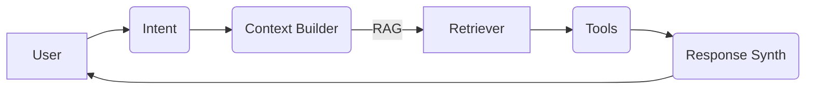

# FULLSTACK CODE DATABASE SAMPLES sim-main

## Verbatim Content (Part 508 of 933)

````text
================================================================================
FULLSTACK SAMPLES CODE DATABASE (VERBATIM) - sim-main
================================================================================
Generated: December 18, 2025
Source: fullstack_samples/sim-main
================================================================================

NOTES:
- This output is verbatim because the source is user-owned.
- Large/binary files may be skipped by size/binary detection limits.

================================================================================

---[FILE: tag-input.tsx]---
Location: sim-main/apps/sim/components/ui/tag-input.tsx
Signals: React

```typescript
'use client'

import { type KeyboardEvent, useRef, useState } from 'react'
import { X } from 'lucide-react'
import { Input } from '@/components/ui/input'
import { cn } from '@/lib/core/utils/cn'

interface TagInputProps {
  value: string[]
  onChange: (tags: string[]) => void
  placeholder?: string
  maxTags?: number
  disabled?: boolean
  className?: string
}

export function TagInput({
  value = [],
  onChange,
  placeholder = 'Type and press Enter',
  maxTags = 10,
  disabled = false,
  className,
}: TagInputProps) {
  const [inputValue, setInputValue] = useState('')
  const inputRef = useRef<HTMLInputElement>(null)

  const addTag = (tag: string) => {
    const trimmedTag = tag.trim()
    if (trimmedTag && !value.includes(trimmedTag) && value.length < maxTags) {
      onChange([...value, trimmedTag])
      setInputValue('')
    }
  }

  const removeTag = (tagToRemove: string) => {
    onChange(value.filter((tag) => tag !== tagToRemove))
  }

  const handleKeyDown = (e: KeyboardEvent<HTMLInputElement>) => {
    if (e.key === 'Enter' && inputValue.trim()) {
      e.preventDefault()
      addTag(inputValue)
    } else if (e.key === 'Backspace' && !inputValue && value.length > 0) {
      removeTag(value[value.length - 1])
    }
  }

  const handleBlur = () => {
    if (inputValue.trim()) {
      addTag(inputValue)
    }
  }

  return (
    <div
      className={cn(
        'scrollbar-hide flex max-h-32 min-h-9 flex-wrap items-center gap-x-[8px] gap-y-[4px] overflow-y-auto rounded-[4px] border border-[var(--surface-11)] bg-[var(--surface-6)] px-[6px] py-[4px] focus-within:outline-none dark:bg-[var(--surface-9)]',
        disabled && 'cursor-not-allowed opacity-50',
        className
      )}
      onClick={() => !disabled && inputRef.current?.focus()}
    >
      {value.map((tag) => (
        <Tag key={tag} value={tag} onRemove={() => removeTag(tag)} disabled={disabled} />
      ))}
      {!disabled && value.length < maxTags && (
        <Input
          ref={inputRef}
          type='text'
          value={inputValue}
          onChange={(e) => setInputValue(e.target.value)}
          onKeyDown={handleKeyDown}
          onBlur={handleBlur}
          placeholder={value.length === 0 ? placeholder : ''}
          disabled={disabled}
          className={cn(
            'h-6 min-w-[180px] flex-1 border-none bg-transparent p-0 font-medium font-sans text-sm placeholder:text-[var(--text-muted)] focus-visible:ring-0 focus-visible:ring-offset-0',
            value.length > 0 ? 'pl-[4px]' : 'pl-[4px]'
          )}
        />
      )}
    </div>
  )
}

interface TagProps {
  value: string
  onRemove: () => void
  disabled?: boolean
}

function Tag({ value, onRemove, disabled }: TagProps) {
  return (
    <div className='flex w-auto items-center gap-[4px] rounded-[4px] border border-[var(--surface-11)] bg-[var(--surface-5)] px-[6px] py-[2px] text-[12px] text-[var(--text-secondary)] hover:text-[var(--text-primary)]'>
      <span className='max-w-[200px] truncate'>{value}</span>
      {!disabled && (
        <button
          type='button'
          onClick={(e) => {
            e.stopPropagation()
            onRemove()
          }}
          className='flex-shrink-0 text-[var(--text-tertiary)] transition-colors hover:text-[var(--text-primary)] focus:outline-none'
          aria-label={`Remove ${value}`}
        >
          <X className='h-[12px] w-[12px] translate-y-[0.2px]' />
        </button>
      )}
    </div>
  )
}
```

--------------------------------------------------------------------------------

---[FILE: textarea.tsx]---
Location: sim-main/apps/sim/components/ui/textarea.tsx
Signals: React

```typescript
import * as React from 'react'
import { cn } from '@/lib/core/utils/cn'

const Textarea = React.forwardRef<HTMLTextAreaElement, React.ComponentProps<'textarea'>>(
  ({ className, ...props }, ref) => {
    return (
      <textarea
        className={cn(
          'flex min-h-[80px] w-full rounded-md border border-input bg-input-background px-3 py-2 text-base ring-offset-background placeholder:text-muted-foreground focus-visible:outline-none focus-visible:ring-2 focus-visible:ring-ring focus-visible:ring-offset-2 disabled:cursor-not-allowed disabled:opacity-50 md:text-sm',
          className
        )}
        ref={ref}
        {...props}
      />
    )
  }
)
Textarea.displayName = 'Textarea'

export { Textarea }
```

--------------------------------------------------------------------------------

---[FILE: toggle.tsx]---
Location: sim-main/apps/sim/components/ui/toggle.tsx
Signals: React

```typescript
'use client'

import * as React from 'react'
import * as TogglePrimitive from '@radix-ui/react-toggle'
import { cva, type VariantProps } from 'class-variance-authority'
import { cn } from '@/lib/core/utils/cn'

// TODO: FIX STYLING
const toggleVariants = cva(
  'inline-flex items-center justify-center rounded-md text-sm font-medium ring-offset-background transition-colors hover:bg-muted hover:text-muted-foreground focus-visible:outline-none focus-visible:ring-2 focus-visible:ring-ring focus-visible:ring-offset-2 disabled:pointer-events-none disabled:opacity-50 data-[state=on]:bg-accent data-[state=on]:text-accent-foreground',
  {
    variants: {
      variant: {
        default: 'bg-transparent',
        outline: 'border border-input bg-transparent hover:bg-accent hover:text-accent-foreground',
      },
      size: {
        default: 'h-10 px-3',
        sm: 'h-9 px-2.5',
        lg: 'h-11 px-5',
      },
    },
    defaultVariants: {
      variant: 'default',
      size: 'default',
    },
  }
)

const Toggle = React.forwardRef<
  React.ElementRef<typeof TogglePrimitive.Root>,
  React.ComponentPropsWithoutRef<typeof TogglePrimitive.Root> & VariantProps<typeof toggleVariants>
>(({ className, variant, size, ...props }, ref) => (
  <TogglePrimitive.Root
    ref={ref}
    className={cn(toggleVariants({ variant, size, className }))}
    {...props}
  />
))

Toggle.displayName = TogglePrimitive.Root.displayName

export { Toggle, toggleVariants }
```

--------------------------------------------------------------------------------

---[FILE: tool-call.tsx]---
Location: sim-main/apps/sim/components/ui/tool-call.tsx
Signals: React

```typescript
'use client'

import { useState } from 'react'
import { CheckCircle, ChevronDown, ChevronRight, Loader2, Settings, XCircle } from 'lucide-react'
import { Badge } from '@/components/ui/badge'
import { Button } from '@/components/ui/button'
import { Collapsible, CollapsibleContent, CollapsibleTrigger } from '@/components/ui/collapsible'
import type { ToolCallGroup, ToolCallState } from '@/lib/copilot/types'
import { cn } from '@/lib/core/utils/cn'

interface ToolCallProps {
  toolCall: ToolCallState
  isCompact?: boolean
}

interface ToolCallGroupProps {
  group: ToolCallGroup
  isCompact?: boolean
}

interface ToolCallIndicatorProps {
  type: 'status' | 'thinking' | 'execution'
  content: string
  toolNames?: string[]
}

// Detection State Component
export function ToolCallDetection({ content }: { content: string }) {
  return (
    <div className='flex min-w-0 items-center gap-2 rounded-lg border border-blue-200 bg-blue-50 px-3 py-2 text-sm dark:border-blue-800 dark:bg-blue-950'>
      <Loader2 className='h-4 w-4 shrink-0 animate-spin text-blue-600 dark:text-blue-400' />
      <span className='min-w-0 truncate text-blue-800 dark:text-blue-200'>{content}</span>
    </div>
  )
}

// Execution State Component
export function ToolCallExecution({ toolCall, isCompact = false }: ToolCallProps) {
  const [isExpanded, setIsExpanded] = useState(!isCompact)

  return (
    <div className='min-w-0 rounded-lg border border-amber-200 bg-amber-50 dark:border-amber-800 dark:bg-amber-950'>
      <Collapsible open={isExpanded} onOpenChange={setIsExpanded}>
        <CollapsibleTrigger asChild>
          <Button
            variant='ghost'
            className='w-full min-w-0 justify-between px-3 py-4 hover:bg-amber-100 dark:hover:bg-amber-900'
          >
            <div className='flex min-w-0 items-center gap-2 overflow-hidden'>
              <Settings className='h-4 w-4 shrink-0 animate-pulse text-amber-600 dark:text-amber-400' />
              <span className='min-w-0 truncate font-mono text-amber-800 text-xs dark:text-amber-200'>
                {toolCall.displayName || toolCall.name}
              </span>
              {toolCall.progress && (
                <Badge
                  variant='outline'
                  className='shrink-0 text-amber-700 text-xs dark:text-amber-300'
                >
                  {toolCall.progress}
                </Badge>
              )}
            </div>
            {isExpanded ? (
              <ChevronDown className='h-4 w-4 shrink-0 text-amber-600 dark:text-amber-400' />
            ) : (
              <ChevronRight className='h-4 w-4 shrink-0 text-amber-600 dark:text-amber-400' />
            )}
          </Button>
        </CollapsibleTrigger>
        <CollapsibleContent className='min-w-0 max-w-full px-3 pb-3'>
          <div className='min-w-0 max-w-full space-y-2'>
            <div className='flex items-center gap-2 text-amber-700 text-xs dark:text-amber-300'>
              <Loader2 className='h-3 w-3 shrink-0 animate-spin' />
              <span>Executing...</span>
            </div>
            {toolCall.parameters &&
              Object.keys(toolCall.parameters).length > 0 &&
              (toolCall.name === 'make_api_request' ||
                toolCall.name === 'set_environment_variables' ||
                toolCall.name === 'set_global_workflow_variables') && (
                <div className='min-w-0 max-w-full rounded border border-amber-200 bg-amber-50 p-2 dark:border-amber-800 dark:bg-amber-950'>
                  {toolCall.name === 'make_api_request' ? (
                    <div className='w-full overflow-hidden rounded border border-muted bg-card'>
                      <div className='grid grid-cols-2 gap-0 border-muted/60 border-b bg-muted/40 px-2 py-1.5'>
                        <div className='font-medium text-[10px] text-muted-foreground uppercase tracking-wide'>
                          Method
                        </div>
                        <div className='font-medium text-[10px] text-muted-foreground uppercase tracking-wide'>
                          Endpoint
                        </div>
                      </div>
                      <div className='grid grid-cols-[auto_1fr] items-center gap-2 px-2 py-2'>
                        <div>
                          <span className='inline-flex rounded bg-muted px-1.5 py-0.5 font-mono text-muted-foreground text-xs'>
                            {String((toolCall.parameters as any).method || '').toUpperCase() ||
                              'GET'}
                          </span>
                        </div>
                        <div className='min-w-0'>
                          <span
                            className='block overflow-x-auto whitespace-nowrap font-mono text-foreground text-xs'
                            title={String((toolCall.parameters as any).url || '')}
                          >
                            {String((toolCall.parameters as any).url || '') || 'URL not provided'}
                          </span>
                        </div>
                      </div>
                    </div>
                  ) : null}

                  {toolCall.name === 'set_environment_variables'
                    ? (() => {
                        const variables =
                          (toolCall.parameters as any).variables &&
                          typeof (toolCall.parameters as any).variables === 'object'
                            ? (toolCall.parameters as any).variables
                            : {}
                        const entries = Object.entries(variables)
                        return (
                          <div className='w-full overflow-hidden rounded border border-amber-200 bg-amber-50 dark:border-amber-800 dark:bg-amber-950'>
                            <div className='grid grid-cols-2 gap-0 border-amber-200/60 border-b px-2 py-1.5 dark:border-amber-800/60'>
                              <div className='font-medium text-[10px] text-amber-700 uppercase tracking-wide dark:text-amber-300'>
                                Name
                              </div>
                              <div className='font-medium text-[10px] text-amber-700 uppercase tracking-wide dark:text-amber-300'>
                                Value
                              </div>
                            </div>
                            {entries.length === 0 ? (
                              <div className='px-2 py-2 text-muted-foreground text-xs'>
                                No variables provided
                              </div>
                            ) : (
                              <div className='divide-y divide-amber-200 dark:divide-amber-800'>
                                {entries.map(([k, v]) => (
                                  <div
                                    key={k}
                                    className='grid grid-cols-[auto_1fr] items-center gap-2 px-2 py-1.5'
                                  >
                                    <div className='truncate font-medium text-amber-800 text-xs dark:text-amber-200'>
                                      {k}
                                    </div>
                                    <div className='min-w-0'>
                                      <span className='block overflow-x-auto whitespace-nowrap font-mono text-amber-700 text-xs dark:text-amber-300'>
                                        {String(v)}
                                      </span>
                                    </div>
                                  </div>
                                ))}
                              </div>
                            )}
                          </div>
                        )
                      })()
                    : null}

                  {toolCall.name === 'set_global_workflow_variables'
                    ? (() => {
                        const ops = Array.isArray((toolCall.parameters as any).operations)
                          ? ((toolCall.parameters as any).operations as any[])
                          : []
                        return (
                          <div className='w-full overflow-hidden rounded border border-amber-200 bg-amber-50 dark:border-amber-800 dark:bg-amber-950'>
                            <div className='grid grid-cols-3 gap-0 border-amber-200/60 border-b px-2 py-1.5 dark:border-amber-800/60'>
                              <div className='font-medium text-[10px] text-amber-700 uppercase tracking-wide dark:text-amber-300'>
                                Name
                              </div>
                              <div className='font-medium text-[10px] text-amber-700 uppercase tracking-wide dark:text-amber-300'>
                                Type
                              </div>
                              <div className='font-medium text-[10px] text-amber-700 uppercase tracking-wide dark:text-amber-300'>
                                Value
                              </div>
                            </div>
                            {ops.length === 0 ? (
                              <div className='px-2 py-2 text-muted-foreground text-xs'>
                                No operations provided
                              </div>
                            ) : (
                              <div className='divide-y divide-amber-200 dark:divide-amber-800'>
                                {ops.map((op, idx) => (
                                  <div
                                    key={idx}
                                    className='grid grid-cols-3 items-center gap-0 px-2 py-1.5'
                                  >
                                    <div className='min-w-0'>
                                      <span className='truncate text-amber-800 text-xs dark:text-amber-200'>
                                        {String(op.name || '')}
                                      </span>
                                    </div>
                                    <div>
                                      <span className='rounded border px-1 py-0.5 text-[10px] text-muted-foreground'>
                                        {String(op.type || '')}
                                      </span>
                                    </div>
                                    <div className='min-w-0'>
                                      {op.value !== undefined ? (
                                        <span className='block overflow-x-auto whitespace-nowrap font-mono text-amber-700 text-xs dark:text-amber-300'>
                                          {String(op.value)}
                                        </span>
                                      ) : (
                                        <span className='text-muted-foreground text-xs'>—</span>
                                      )}
                                    </div>
                                  </div>
                                ))}
                              </div>
                            )}
                          </div>
                        )
                      })()
                    : null}
                </div>
              )}
          </div>
        </CollapsibleContent>
      </Collapsible>
    </div>
  )
}

// Completion State Component
export function ToolCallCompletion({ toolCall, isCompact = false }: ToolCallProps) {
  const [isExpanded, setIsExpanded] = useState(false)
  const isSuccess = toolCall.state === 'completed'
  const isError = toolCall.state === 'error'
  const isAborted = toolCall.state === 'aborted'

  const formatDuration = (duration?: number) => {
    if (!duration) return ''
    return duration < 1000 ? `${duration}ms` : `${(duration / 1000).toFixed(1)}s`
  }

  return (
    <div
      className={cn(
        'min-w-0 rounded-lg border',
        isSuccess && 'border-green-200 bg-green-50 dark:border-green-800 dark:bg-green-950',
        isError && 'border-red-200 bg-red-50 dark:border-red-800 dark:bg-red-950',
        isAborted && 'border-orange-200 bg-orange-50 dark:border-orange-800 dark:bg-orange-950'
      )}
    >
      <Collapsible open={isExpanded} onOpenChange={setIsExpanded}>
        <CollapsibleTrigger asChild>
          <Button
            variant='ghost'
            className={cn(
              'w-full min-w-0 justify-between px-3 py-4',
              isSuccess && 'hover:bg-green-100 dark:hover:bg-green-900',
              isError && 'hover:bg-red-100 dark:hover:bg-red-900',
              isAborted && 'hover:bg-orange-100 dark:hover:bg-orange-900'
            )}
          >
            <div className='flex min-w-0 items-center gap-2 overflow-hidden'>
              {isSuccess && (
                <CheckCircle className='h-4 w-4 shrink-0 text-green-600 dark:text-green-400' />
              )}
              {isError && <XCircle className='h-4 w-4 shrink-0 text-red-600 dark:text-red-400' />}
              {isAborted && (
                <XCircle className='h-4 w-4 shrink-0 text-orange-600 dark:text-orange-400' />
              )}
              <span
                className={cn(
                  'min-w-0 truncate font-mono text-xs',
                  isSuccess && 'text-green-800 dark:text-green-200',
                  isError && 'text-red-800 dark:text-red-200',
                  isAborted && 'text-orange-800 dark:text-orange-200'
                )}
              >
                {toolCall.displayName || toolCall.name}
              </span>
              {toolCall.duration && (
                <Badge
                  variant='outline'
                  className={cn(
                    'shrink-0 text-xs',
                    isSuccess && 'text-green-700 dark:text-green-300',
                    isError && 'text-red-700 dark:text-red-300',
                    isAborted && 'text-orange-700 dark:text-orange-300'
                  )}
                  style={{ fontSize: '0.625rem' }}
                >
                  {formatDuration(toolCall.duration)}
                </Badge>
              )}
            </div>
            <div className='flex shrink-0 items-center'>
              {isExpanded ? (
                <ChevronDown
                  className={cn(
                    'h-4 w-4',
                    isSuccess && 'text-green-600 dark:text-green-400',
                    isError && 'text-red-600 dark:text-red-400'
                  )}
                />
              ) : (
                <ChevronRight
                  className={cn(
                    'h-4 w-4',
                    isSuccess && 'text-green-600 dark:text-green-400',
                    isError && 'text-red-600 dark:text-red-400'
                  )}
                />
              )}
            </div>
          </Button>
        </CollapsibleTrigger>
        <CollapsibleContent className='min-w-0 max-w-full px-3 pb-3'>
          <div className='min-w-0 max-w-full space-y-2'>
            {toolCall.parameters &&
              Object.keys(toolCall.parameters).length > 0 &&
              (toolCall.name === 'make_api_request' ||
                toolCall.name === 'set_environment_variables') && (
                <div
                  className={cn(
                    'min-w-0 max-w-full rounded p-2',
                    isSuccess && 'bg-green-100 dark:bg-green-900',
                    isError && 'bg-red-100 dark:bg-red-900'
                  )}
                >
                  <div
                    className={cn(
                      'mb-1 font-medium text-xs',
                      isSuccess && 'text-green-800 dark:text-green-200',
                      isError && 'text-red-800 dark:text-red-200'
                    )}
                  >
                    Parameters:
                  </div>
                  <div
                    className={cn(
                      'min-w-0 max-w-full break-all font-mono text-xs',
                      isSuccess && 'text-green-700 dark:text-green-300',
                      isError && 'text-red-700 dark:text-red-300'
                    )}
                  >
                    {JSON.stringify(toolCall.parameters, null, 2)}
                  </div>
                </div>
              )}

            {toolCall.error && (
              <div className='min-w-0 max-w-full rounded bg-red-100 p-2 dark:bg-red-900'>
                <div className='mb-1 font-medium text-red-800 text-xs dark:text-red-200'>
                  Error:
                </div>
                <div className='min-w-0 max-w-full break-all font-mono text-red-700 text-xs dark:text-red-300'>
                  {toolCall.error}
                </div>
              </div>
            )}
          </div>
        </CollapsibleContent>
      </Collapsible>
    </div>
  )
}

// Group Component for Multiple Tool Calls
export function ToolCallGroupComponent({ group, isCompact = false }: ToolCallGroupProps) {
  const [isExpanded, setIsExpanded] = useState(true)

  const completedCount = group.toolCalls.filter((t) => t.state === 'completed').length
  const totalCount = group.toolCalls.length
  const isAllCompleted = completedCount === totalCount
  const hasErrors = group.toolCalls.some((t) => t.state === 'error')

  return (
    <div className='min-w-0 space-y-2'>
      {group.summary && (
        <div className='flex min-w-0 items-center gap-2 rounded-lg border border-blue-200 bg-blue-50 px-3 py-2 text-sm dark:border-blue-800 dark:bg-blue-950'>
          <Settings className='h-4 w-4 shrink-0 text-blue-600 dark:text-blue-400' />
          <span className='min-w-0 truncate text-blue-800 dark:text-blue-200'>{group.summary}</span>
          {!isAllCompleted && (
            <Badge variant='outline' className='shrink-0 text-blue-700 text-xs dark:text-blue-300'>
              {completedCount}/{totalCount}
            </Badge>
          )}
        </div>
      )}

      <Collapsible open={isExpanded} onOpenChange={setIsExpanded}>
        <CollapsibleTrigger asChild>
          <Button
            variant='ghost'
            className='w-full min-w-0 justify-between px-3 py-3 text-sm hover:bg-muted'
          >
            <div className='flex min-w-0 items-center gap-2 overflow-hidden'>
              <span className='min-w-0 truncate text-muted-foreground'>
                {isAllCompleted ? 'Completed' : 'In Progress'} ({completedCount}/{totalCount})
              </span>
              {hasErrors && (
                <Badge variant='destructive' className='shrink-0 text-xs'>
                  Errors
                </Badge>
              )}
            </div>
            {isExpanded ? (
              <ChevronDown className='h-4 w-4 shrink-0 text-muted-foreground' />
            ) : (
              <ChevronRight className='h-4 w-4 shrink-0 text-muted-foreground' />
            )}
          </Button>
        </CollapsibleTrigger>
        <CollapsibleContent className='min-w-0 max-w-full space-y-2'>
          {group.toolCalls.map((toolCall) => (
            <div key={toolCall.id} className='min-w-0 max-w-full'>
              {toolCall.state === 'executing' && (
                <ToolCallExecution toolCall={toolCall} isCompact={isCompact} />
              )}
              {(toolCall.state === 'completed' || toolCall.state === 'error') && (
                <ToolCallCompletion toolCall={toolCall} isCompact={isCompact} />
              )}
            </div>
          ))}
        </CollapsibleContent>
      </Collapsible>
    </div>
  )
}

// Status Indicator Component
export function ToolCallIndicator({ type, content, toolNames }: ToolCallIndicatorProps) {
  if (type === 'status' && toolNames) {
    return (
      <div className='flex min-w-0 items-center gap-2 rounded-lg border border-blue-200 bg-blue-50 px-3 py-2 text-sm dark:border-blue-800 dark:bg-blue-950'>
        <Loader2 className='h-4 w-4 shrink-0 animate-spin text-blue-600 dark:text-blue-400' />
        <span className='min-w-0 truncate text-blue-800 dark:text-blue-200'>
          🔄 {toolNames.join(' • ')}
        </span>
      </div>
    )
  }

  return (
    <div className='flex min-w-0 items-center gap-2 rounded-lg border border-blue-200 bg-blue-50 px-3 py-2 text-sm dark:border-blue-800 dark:bg-blue-950'>
      <Loader2 className='h-4 w-4 shrink-0 animate-spin text-blue-600 dark:text-blue-400' />
      <span className='min-w-0 truncate text-blue-800 dark:text-blue-200'>{content}</span>
    </div>
  )
}
```

--------------------------------------------------------------------------------

---[FILE: verified-badge.tsx]---
Location: sim-main/apps/sim/components/ui/verified-badge.tsx

```typescript
import { Tooltip } from '@/components/emcn'
import { cn } from '@/lib/core/utils/cn'

interface VerifiedBadgeProps {
  className?: string
  size?: 'sm' | 'md' | 'lg'
}

export function VerifiedBadge({ className, size = 'md' }: VerifiedBadgeProps) {
  const sizeMap = {
    sm: 12,
    md: 14,
    lg: 16,
  }

  const dimension = sizeMap[size]

  return (
    <Tooltip.Root>
      <Tooltip.Trigger asChild>
        <div className={cn('inline-flex flex-shrink-0', className)}>
          <svg
            width={dimension}
            height={dimension}
            viewBox='0 0 16 16'
            fill='none'
            xmlns='http://www.w3.org/2000/svg'
          >
            <path
              d='M16 8.375C16 8.93437 15.8656 9.45312 15.5969 9.92813C15.3281 10.4031 14.9688 10.775 14.5156 11.0344C14.5281 11.1188 14.5344 11.25 14.5344 11.4281C14.5344 12.275 14.25 12.9937 13.6875 13.5875C13.1219 14.1844 12.4406 14.4812 11.6438 14.4812C11.2875 14.4812 10.9469 14.4156 10.625 14.2844C10.375 14.7969 10.0156 15.2094 9.54375 15.525C9.075 15.8438 8.55937 16 8 16C7.42812 16 6.90938 15.8469 6.44688 15.5344C5.98125 15.225 5.625 14.8094 5.375 14.2844C5.05312 14.4156 4.71562 14.4812 4.35625 14.4812C3.55937 14.4812 2.875 14.1844 2.30312 13.5875C1.73125 12.9937 1.44687 12.2719 1.44687 11.4281C1.44687 11.3344 1.45938 11.2031 1.48125 11.0344C1.02813 10.7719 0.66875 10.4031 0.4 9.92813C0.134375 9.45312 0 8.93437 0 8.375C0 7.78125 0.15 7.23438 0.446875 6.74062C0.74375 6.24687 1.14375 5.88125 1.64375 5.64375C1.5125 5.2875 1.44687 4.92812 1.44687 4.57188C1.44687 3.72813 1.73125 3.00625 2.30312 2.4125C2.875 1.81875 3.55937 1.51875 4.35625 1.51875C4.7125 1.51875 5.05312 1.58438 5.375 1.71563C5.625 1.20312 5.98438 0.790625 6.45625 0.475C6.925 0.159375 7.44063 0 8 0C8.55937 0 9.075 0.159375 9.54375 0.471875C10.0125 0.7875 10.375 1.2 10.625 1.7125C10.9469 1.58125 11.2844 1.51562 11.6438 1.51562C12.4406 1.51562 13.1219 1.8125 13.6875 2.40937C14.2531 3.00625 14.5344 3.725 14.5344 4.56875C14.5344 4.9625 14.475 5.31875 14.3562 5.64062C14.8562 5.87813 15.2563 6.24375 15.5531 6.7375C15.85 7.23438 16 7.78125 16 8.375ZM7.65938 10.7844L10.9625 5.8375C11.0469 5.70625 11.0719 5.5625 11.0437 5.40938C11.0125 5.25625 10.9344 5.13438 10.8031 5.05312C10.6719 4.96875 10.5281 4.94063 10.375 4.9625C10.2188 4.9875 10.0938 5.0625 10 5.19375L7.09062 9.56875L5.75 8.23125C5.63125 8.1125 5.49375 8.05625 5.34062 8.0625C5.18437 8.06875 5.05 8.125 4.93125 8.23125C4.825 8.3375 4.77187 8.47187 4.77187 8.63437C4.77187 8.79375 4.825 8.92813 4.93125 9.0375L6.77187 10.8781L6.8625 10.95C6.96875 11.0219 7.07812 11.0562 7.18437 11.0562C7.39375 11.0531 7.55313 10.9656 7.65938 10.7844Z'
              fill='#33B4FF'
            />
          </svg>
        </div>
      </Tooltip.Trigger>
      <Tooltip.Content>Verified Creator</Tooltip.Content>
    </Tooltip.Root>
  )
}
```

--------------------------------------------------------------------------------

---[FILE: user-avatar.tsx]---
Location: sim-main/apps/sim/components/user-avatar/user-avatar.tsx
Signals: React, Next.js

```typescript
'use client'

import { type CSSProperties, useEffect, useState } from 'react'
import Image from 'next/image'
import { getUserColor } from '@/app/workspace/[workspaceId]/w/utils/get-user-color'

interface UserAvatarProps {
  userId: string
  userName?: string | null
  avatarUrl?: string | null
  size?: number
  className?: string
}

/**
 * Reusable user avatar component with error handling for image loading.
 * Falls back to colored circle with initials if image fails to load or is not available.
 */
export function UserAvatar({
  userId,
  userName,
  avatarUrl,
  size = 32,
  className = '',
}: UserAvatarProps) {
  const [imageError, setImageError] = useState(false)
  const color = getUserColor(userId)
  const initials = userName ? userName.charAt(0).toUpperCase() : '?'
  const hasAvatar = Boolean(avatarUrl) && !imageError

  // Reset error state when avatar URL changes
  useEffect(() => {
    setImageError(false)
  }, [avatarUrl])

  const fontSize = Math.max(10, size / 2.5)

  return (
    <div
      className={`relative flex flex-shrink-0 items-center justify-center overflow-hidden rounded-full font-semibold text-white ${className}`}
      style={
        {
          background: hasAvatar ? undefined : color,
          width: `${size}px`,
          height: `${size}px`,
          fontSize: `${fontSize}px`,
        } as CSSProperties
      }
    >
      {hasAvatar && avatarUrl ? (
        <Image
          src={avatarUrl}
          alt={userName ? `${userName}'s avatar` : 'User avatar'}
          fill
          sizes={`${size}px`}
          className='object-cover'
          referrerPolicy='no-referrer'
          unoptimized
          onError={() => setImageError(true)}
        />
      ) : (
        initials
      )}
    </div>
  )
}
```

--------------------------------------------------------------------------------

---[FILE: adam.json]---
Location: sim-main/apps/sim/content/authors/adam.json

```json
{
  "id": "adam",
  "name": "Adam Gough",
  "url": "https://x.com/adamgough",
  "xHandle": "adamgough",
  "avatarUrl": "/studio/authors/adam.png"
}
```

--------------------------------------------------------------------------------

---[FILE: emir.json]---
Location: sim-main/apps/sim/content/authors/emir.json

```json
{
  "id": "emir",
  "name": "Emir Karabeg",
  "url": "https://x.com/karabegemir",
  "xHandle": "karabegemir",
  "avatarUrl": "/studio/authors/emir.png"
}
```

--------------------------------------------------------------------------------

---[FILE: sid.json]---
Location: sim-main/apps/sim/content/authors/sid.json

```json
{
  "id": "sid",
  "name": "Siddharth",
  "url": "https://x.com/sidganesan",
  "xHandle": "sidganesan",
  "avatarUrl": "/studio/authors/sid.png"
}
```

--------------------------------------------------------------------------------

---[FILE: sim.json]---
Location: sim-main/apps/sim/content/authors/sim.json

```json
{
  "id": "sim",
  "name": "The Sim Team",
  "url": "https://x.com/simdotai",
  "xHandle": "simdotai",
  "avatarUrl": "/logo/primary/small.png"
}
```

--------------------------------------------------------------------------------

---[FILE: vik.json]---
Location: sim-main/apps/sim/content/authors/vik.json

```json
{
  "id": "vik",
  "name": "Vikhyath Mondreti",
  "url": "https://github.com/icecrasher321",
  "xHandle": "icecrasher321",
  "avatarUrl": "/studio/authors/vik.jpg"
}
```

--------------------------------------------------------------------------------

---[FILE: waleed.json]---
Location: sim-main/apps/sim/content/authors/waleed.json

```json
{
  "id": "waleed",
  "name": "Waleed Latif",
  "url": "https://x.com/typingwala",
  "xHandle": "typingwala",
  "avatarUrl": "/studio/authors/waleed.png"
}
```

--------------------------------------------------------------------------------

---[FILE: index.mdx]---
Location: sim-main/apps/sim/content/blog/copilot/index.mdx

```text
---
slug: copilot
title: 'Inside Sim Copilot — architecture, benchmarks, and how it fits'
description: 'A technical overview of Sim Copilot: the architecture behind it, our early benchmarks, and how Copilot integrates with agentic workflows in Sim.'
date: 2025-11-08
updated: 2025-11-08
authors:
  - sid
readingTime: 7
tags: [Copilot, AI Assistant, Benchmarks, Architecture, Sim]
ogImage: /studio/copilot/cover.png
ogAlt: 'Sim Copilot technical overview'
about: ['AI Assistants', 'Agentic Workflows', 'Retrieval Augmented Generation']
timeRequired: PT7M
canonical: https://sim.ai/studio/copilot
featured: false
draft: true
---

> This is a technical deep‑dive scaffold for Sim Copilot. We’ll keep updating it as we publish more results and open up additional capabilities.

## TL;DR

- Copilot is a context‑aware assistant embedded into the Sim editor.  
- It has first‑class access (with user approval) to workflows, blocks, logs, and docs.  
- The system is retrieval‑centric with strong guardrails and deterministic execution paths.  

## Architecture at a glance

1. Intent understanding  
   - Lightweight classifier + instruction parser directs requests into tools.  
2. Context assembly  
   - Indexed sources (workflows, blocks, logs, docs) with semantic and lexical signals.  
   - Safety filters for scope + permission checks.  
3. Tooling and actions  
   - Read‑only tools (explain, compare, search), propose‑changes tools, and execution tools.  
4. Response synthesis  
   - Deterministic templates for diffs, plans, and explanations.  
5. Human‑in‑the‑loop  
   - All writes gated behind explicit user approval.



## Retrieval and grounding

- Sources: workspace workflows, block metadata, execution logs, and product docs.  
- Indexing: hybrid scoring (BM25 + embeddings) with recency decay and per‑source caps.  
- Normalization: chunking with stable anchors so diffs remain line‑referential.  

## Early benchmarks (scaffold)

> Numbers below are placeholders for the structure; we’ll replace with full runs.

| Task                                | Top‑1 Retrieval@K | Edit Accuracy | Time (p50) |
| ----------------------------------- | -----------------:| ------------: | ---------: |
| Explain a workflow block            | 92%               | 88%           | 1.2s       |
| Propose a safe fix for an error     | 78%               | 70%           | 2.1s       |
| Generate a new block configuration  | 74%               | 65%           | 2.6s       |
| Find relevant execution logs        | 90%               | 84%           | 1.4s       |

Measurement notes:

- Retrieval@K: correctness of the top candidate chunk for a labeled query.  
- Edit Accuracy: human‑validated acceptance rate for proposed changes.  
- Time: server‑side latency (excludes model cold‑start).  

## Guardrails and safety

- Scope enforcement: actions limited to the open workspace with explicit user triggers.  
- Sensitive data policies and redaction in logs.  
- Proposal mode: diffs are reviewed and applied only on user approval.  

## How Copilot fits into Sim

- In‑editor assistant for building and editing workflows.  
- Shortcut to documentation and examples with live context from your canvas.  
- Bridge to evaluation: Copilot can set up test runs and compare outputs side‑by‑side.  
- Works with the same permissions model you already use in Sim.  

## Roadmap (high‑level)

- Multi‑turn plans with sub‑tasks and rollback.  
- Deeper evaluation harness and dataset management.  
- First‑party tool plugins for common blocks and providers.  

## Repro and transparency

- We’ll publish a benchmark harness and anonymized evaluation sets.  
- Expect a detailed methodology post as we widen the beta.  

— Sid @ Sim
```

--------------------------------------------------------------------------------

````
